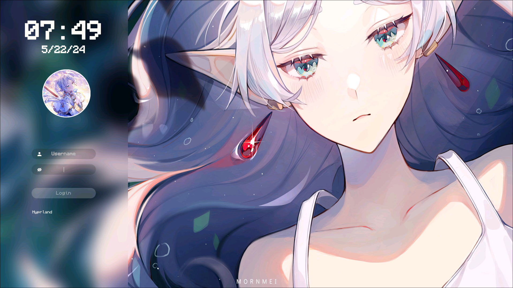

# sddm-akarumi-theme
My personal SDDM Theme

# To-Do List
| Task | Done |
|--|--|
| Choose Background |  |
| Move Background to assets | x |
| Rework panel sizing | x |
| Insert User Avatar | ~ |
| Rework Components | ~ |
| Rework Assets | x |


# Preview


# Dependencies
```
qt6-5compat qt6-declarative qt6-svg sddm
```

# Install
First clone the repository
If needed copy needed fonts into your fonts folder
```
sudo git clone https://github.com/akarumi/sddm-personal-theme.git /usr/share/sddm/themes/sddm-akarumi-theme
sudo cp /usr/share/sddm/themes/sddm-akarumi-theme/Fonts/* /usr/share/fonts/
```
After that edit `/etc/sddm.conf` or `/etc/sddm.conf.d/theme.conf` 
Change the `current` section to the following
```
Current=sddm-akarumi-theme
```
### Extra installation
User Icon source path: `Assets/Avatars` + `username` + `imgType`

Add your profile picture under `Assets/Avatars/`
Lastly edit theme.conf and update usernamePlaceholder to your username/filename and set the imgType to corresponding image type, I couldn't get this information out of the userModel yet

